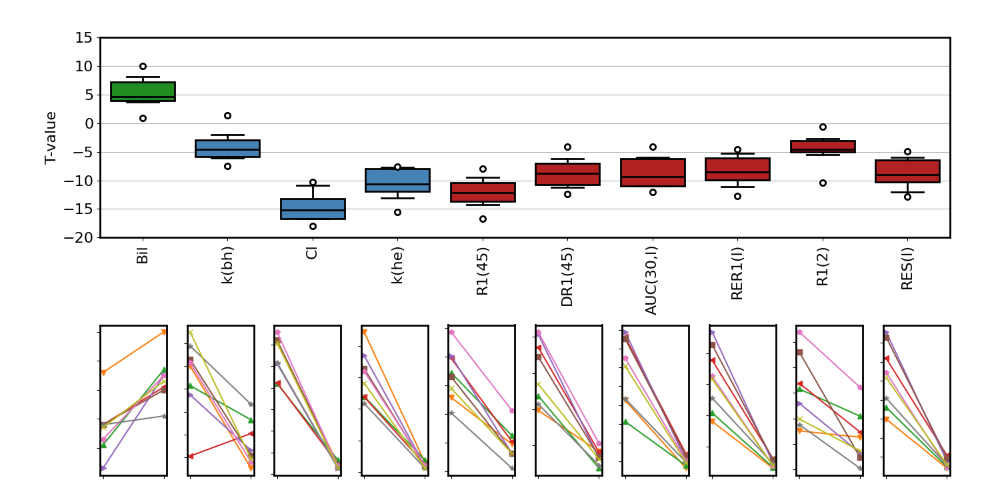

---

## An MRI-assay for drug-induced inhibition of liver transporters: first-in-human study

[](https://www.apache.org/licenses/LICENSE-2.0) [](https://creativecommons.org/licenses/by/4.0/) [](https://github.com/openmiblab/tristan-human-stage-3-analysis/blob/main/src/run.ipynb)


## 📚 Context 

The liver is responsible for filtering waste products from the blood, and evacuating these by excreting them to bile. Drugs commonly affect these procesesses, potentially leading to toxic side effects.

If a drug inhibits excretion into the bile, then harmful material can get stuck in liver cells and cause damage to the liver. This is commonly referred to as drug-induced liver injury (DILI). If a drug on the other hand blocks the uptake of these materials into the liver, they will circulate in the blood for too long and may cause harm elsewehere.

When dealing with novel drugs, either in basic research or drug development, it is often unknown to what extent a drug affects the uptake or excretion into the liver. This can expose trial participants to significant risk, or even patients in clinical practice if the risk is not identified during development.

In order to mitigate these risks, the [TRISTAN project](https://www.imi-tristan.eu/) developed an MRI-based method to measure the effect of drugs in liver transporters directly. An [analysis pipeline](https://zenodo.org/records/15512551) was developed which generates measurements from signal-time curves in liver and aorta. 

The pipeline in this repository was used to derive results in the first-in-human study, which measured the effect of the drug rifampicin on the biomarkers produced by the assay, in 8 healthy volunteers. 

## 🛠️ Methodology 

The **inputs** to the pipeline are metrics produced by the assay for primary and secondary objectives, saved in a [persistent data archive](https://zenodo.org/records/15514373) as three separate datasets:
- *tristan_humans_healthy_rifampicin_all_results*: MRI biomarkers in subjects with successful treatment visits
- *tristan_humans_healthy_controls_all_results*: MRI biomarkers in subjects with baseline visits only.
- *tristan_humans_leeds_covariates*: clinical covariates such as demographics and blood-based liver function tests in all subjects.

The **output** is the effect of the drugs on primary and secondary endpoints, as well as results for additional questions such as correlations between baseline values and with effect sizes measured by conventional liver function tests. The pipeline computes the statistics and generates tables and figures for internal reporting and inclusion in the publication.

## 💻 Usage

The pipeline can be run after installing the requirements:

```console
pip install -r requirements.txt
```

The folder *build* contains the output of the analysis. To reproduce it, delete the *build* folder and run the script **src/run.py**. This takes less than a minute on a standard laptop computer and should recreate all results in the *build* folder.

Alternatively run the jupyter notebook [src/run.ipynb](https://github.com/openmiblab/tristan-human-stage-3-analysis/blob/main/src/run.ipynb) which reproduces all results interactively and has explanations and results interleaved with the code for better understanding of the metholodology.


## 	📄 Code structure

The **src** folder contains all the source code, with the top level entry scripts *run.py* and [src/run.ipynb](https://github.com/openmiblab/tristan-human-stage-3-analysis/blob/main/src/run.ipynb). These call functions in the subfolder *stages*.

The **build** folder contains the output of the top level scripts. It can be deleted and will be fully rebuilt when running the script. The *build* folder has the following contents: 

- *Report.pdf* is a compact summary of all key outputs. It is built in LaTeX and the folder *Report_source* contains the source LaTeX files.
- *Data*: contains the downloaded data and their modifications by the script *src/stages/data.py*.
- *Figs*: Figures produced by *src/stages/plot.py*.
- *Tables*: tables and numerical results produced by *src/stages/desc.py* and *src/stages/calc.py*.


## ❤️ Citation 

The manuscript is under review. A summary of results was presented at the ISMRM (Singapore 2024):

Thazin Min, Marta Tibiletti, Paul Hockings, Aleksandra Galetin, Ebony Gunwhy, Gerry Kenna, Nicola Melillo, Geoff JM Parker, Gunnar Schuetz, Daniel Scotcher, John Waterton, Ian Rowe, and Steven Sourbron. Measurement of liver function with dynamic gadoxetate-enhanced MRI: a validation study in healthy volunteers. [Proc Intl Soc Mag Reson Med, Singapore 2024, 4015](https://archive.ismrm.org/2024/4015.html).

## 💰 Funding 

The work was performed as part of the [TRISTAN project](https://www.imi-tristan.eu/) on imaging biomarkers for drug toxicity. The project was EU-funded through the [Innovative Health Initiative](https://www.ihi.europa.eu/).

[](https://www.imi-tristan.eu/)

## 👥 Contributors

<!-- ALL-CONTRIBUTORS-LIST:START - Do not remove or modify this section -->
<!-- prettier-ignore-start -->
<!-- markdownlint-disable -->
<table>
  <tbody>
    <tr>
      <td align="center" valign="top" width="14.28%"><a href="https://github.com/EShalom"><br /><sub><b>Eve Shalom</b></sub></a><br /></td>
      <td align="center" valign="top" width="14.28%"><a href="https://github.com/plaresmedima"><br /><sub><b>Steven Sourbron</b></sub></a><br /></td>
    </tr>
  </tbody>
</table>
